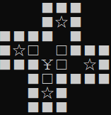
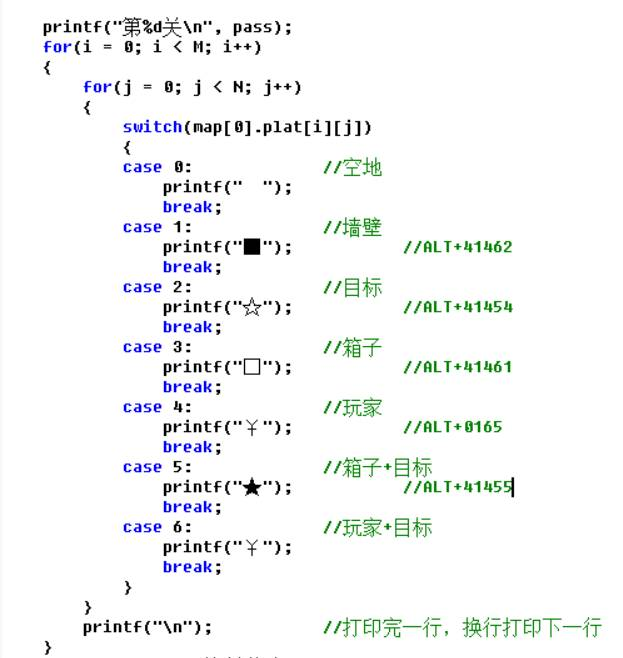
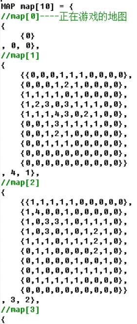
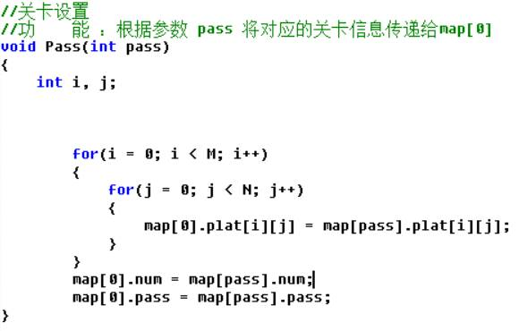
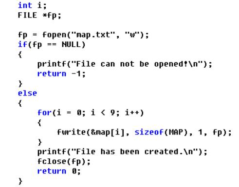
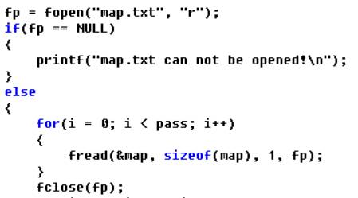
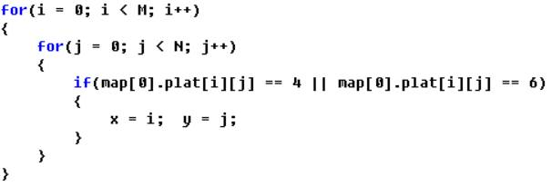
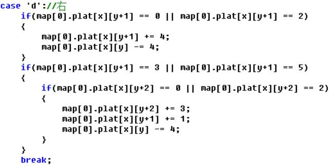
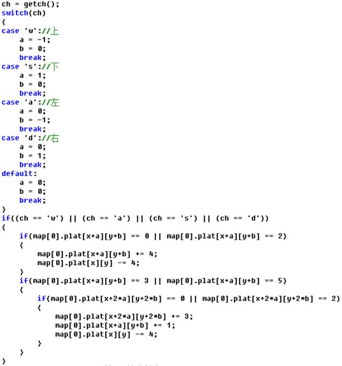
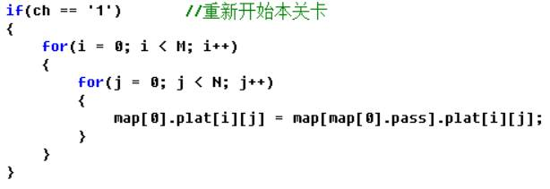

**1.需求分析及设计思路**

推箱子是一款简单的小游戏。

玩家只要操纵小人（游戏中以 ¥ 表示）将全部箱子（以 □ 表示）推进指定位置中（以 ☆ 表示）即可胜利。当箱子被推进指定位置时，会变成 ★ 。游戏地图被一圈墙壁包裹（以 ■ 表示）。

 

**(1)** **打印地图**

 

使用一个二维数组来表示：

map = {

   {0,0,0,1,1,1,0,0,0,0},

   {0,0,0,1,2,1,0,0,0,0},

   {1,1,1,1,0,1,0,0,0,0},

   {1,2,3,0,3,1,1,1,0,0},

   {1,1,1,4,3,0,2,1,0,0},

   {0,0,1,3,1,1,1,1,0,0},

   {0,0,1,2,1,0,0,0,0,0},

   {0,0,1,1,1,0,0,0,0,0},

   {0,0,0,0,0,0,0,0,0,0},

   {0,0,0,0,0,0,0,0,0,0}

   };

//空地 墙壁 目标 箱子 玩家

// 0   1   2   3   4

//    ■  ☆  □  ¥

然后，在 DrawMap() 函数中，使用 for 循环遍历整个数组，用 switch 选择控制结构分别打印对应的字符即可。（注意：打印完一行后需要换行！）

 

 

 

**(2) 关卡设置**

每一关中的主要信息除了地图外，还需要此关的箱子数量和此关的编号。所以我们定义一种结构体。

typedef struct Map

{

  int plat[M][N];  //地图

  int num;  //每一关的箱子数

  int pass;   //关卡数

}MAP;

然后，声明一个MAP类型的一维数组，

 

**(**由于篇幅有限，并未全部展示**)**

 

其中map[0]是正在进行的地图，可以由其他map传值或者用户操作改变值。而map[1] 到 map[9]是每一关的游戏地图，其值不能改变。

 

用Pass() 函数将每一关的信息传递给 map[0],进行关卡的初始化。

 

当然，上述方法会使得并不需要的9个地图数据占用内存。所以我们将这些数据以文件的形式存储在内存中，需要时再读取。

** **

这样的话，Pass()函数就可改为

****

由于map.txt文件中存储了9个关卡地图，用for循环不断赋值给map,直到更新到第pass个地图。pass是函数Pass()的入口参数，

 

**(3)游戏控制**

我们使用 w a s d 四个键来控制小人的移动。注意到游戏中除了以下五种元素，还需要一些元素。

//空地 墙壁 目标 箱子 玩家

// 0   1   2   3   4

//    ■  ☆  □  ¥

分别是：

//箱子在目标中：★ 5 = 2+3

//人站在目标上：¥  6 = 2+4

（至于为什么这两个元素要设为另两个元素ID之和，稍后会解释）

为了控制小人移动我们先要遍历数组map[0]找到小人（4或6）。

 

并将其坐标给记下（即给x,y赋值），map[x][y]表示人。

 

**游戏中会有一下几中情况（以向右走为例）：**

[1] 人站在空地上，右边是空地

​        ¥  -->  ¥    4 0 --> 0 4

或者 人站在空地上，右边是目标

​        ¥ ☆ -->   ¥    4 2 --> 0 6

或者 人站在目标上，右边是空地

​        ¥  --> ☆ ¥    6 0 --> 0 6

或者 人站在目标上，右边是目标

​       ¥ ☆ --> ☆ ¥    6 2 --> 2 6

但这四种情况都可以用以下算法：

map[0].plat[x][y+1] += 4;

map[0].plat[x][y]  -= 4;

 

[2]人站在空地/目标上，右边是箱子/箱子在目标上，箱子右边是空地/目标。

  此种情况就不展开讲了。与第一种情况思路一样。

4/6 3/5 0/2 --> 0/2 4/6 3/5

 ¥   □   -->    ¥    □

可以用一下算法：

map[0].plat[x][y+2] += 3;

map[0].plat[x][y+1] += 1;

map[0].plat[x][y]  -= 4;

由此可见，巧妙的设置ID代码可以简化许多。

**综上所述，加上if语句判断条件即可，然后再次打印地图即可显现出小人走动的情形。(向其他方向与此相同)**

为了尽量统一，使代码尽量简洁，可以用以下方法：

****

 

当用户按下1想重新开始时，根据map[0].pass的值判断当前是哪一关并将相应关卡信息传递给map[0]。

 

 

 

 

 

 