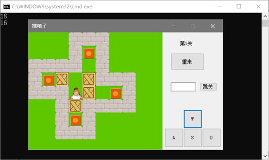
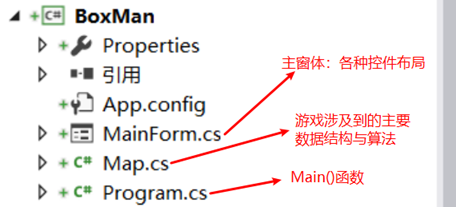
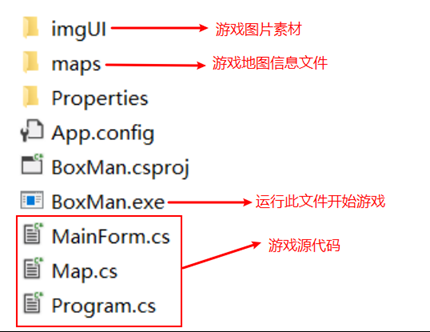

## 1. 界面简介

 

游戏区域主要由左边的游戏区和右边的控制区组成。游戏目的是控制小人把所有的箱子推到目标位置即可，游戏共有九关。控制小人移动可以使用键盘上的WASD四个键，也可以点击屏幕右下角的控制按钮。

点击重来按钮可以重新开始本关卡。在文本框内输入关卡数，并按下跳关按钮，就可以进行跳关。

*TODO：控制跳关文本框的输入，只能输入数字*

## 2. 文件结构

 

 

