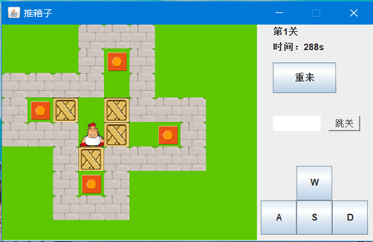
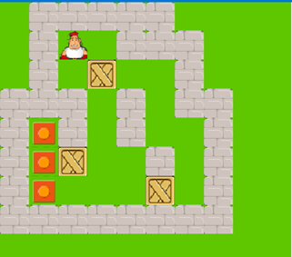

## 1. 界面简介

### 1.1. 登录界面

启动程序时的第一个界面是登录界面，其样式如下图所示：

 

登录界面的实现代码全部在Login.java文件中，其中包括两个外部class一个是登录窗体的类Login，另一个是继承自JButton的具有名字信息的图片按钮。在Login类中还定义了一些用于实现窗体功能响应的时间监听器类。窗体采用流式布局，并使得窗体大小不可更改。直观来看，窗体由最上方的风景图片，中间的用户名与密码框以及下方的记住密码、自动登录复选框，登录按钮和绿色字体的提示信息所构成。

窗体的背景设置为深蓝色，但是直接设置窗体颜色是不行的。这是应为JFrame当中使用流式布局管理器(FlowLayout)将整个窗体进行覆盖操作，也就是说设置的颜色确实是存在的，只是被布局管理器给覆盖住了，所以无法看见。为了达到填充背景色的目的，在窗体当中添加一个面板操作,并进行对象的上转型操作。使得窗体面板容器占满整个窗体容器，然后直接对窗体面板当中的背景颜色进行设置就可以达到相同的视觉效果。

两个文本输入框是整个窗体的核心，为了防止不小心或者恶意的非法数据输入，采用正则表达式以及单个字符比较过滤的方式使得用户名只能由1~10位数字组成，密码由6~24位数字或者大小写字母组成，并且在窗体最下方显示提示信息。

登录按钮以及其他两个注册和忘记密码按钮是由JButton类继承并且增加了鼠标互动功能的图片按钮。当鼠标进入按钮上方其颜色会变深，当鼠标点击按钮时，颜色继续加深，效果如图所示。这样的设计增加了用户交互的趣味性。

 

 

 

 登录按钮的三种变化（上：原色；中：鼠标进入按钮上方；下：鼠标点击按钮）

点击登录，则会向服务器请求数据并保存在一个哈希表中，然后将用户输入的用户名与哈希表集合中的用户名对比，如果用户不存在，则弹出错误窗口；如果可以匹配用户名，则把密码发送给服务器，由服务器验证密码的正确性并反馈给客户端。登陆成功后即可进入游戏游玩。

如果勾选了“记住密码”复选框，则会在登录成功的前提下，将用户名与密码加密保存在本地。若下次登录时勾选了“自动登录”，会自动填充密码。加密方式采用凯撒密码。

 

如果需要注册账号，将用户名与密码按提示信息的规则填写好，按下注册账号按钮即可。之后会跳转到用户信息收集界面。

### 1.2. 用户信息收集界面

用户信息收集窗体的代码是Register.java文件，其中一个用于架构窗体的Register类和一个用于存储窗体获取到的用户信息封装好的用户类User。

用户信息收集界面包括一些基本信息的填写，用到了几乎所有的容器组件。其中年龄输入框也是使用正则的方法过滤掉了除数字外的字符，并且限制在1~199。下方三个按钮，确认按钮将所收集到的信息存储到User类的实例对象中，并发送给后台服务器；取消按钮使得所有组件的状态初始化位默认值；退出按钮退出这个子窗口，但不退出程序。

 

### 1.3. 游戏界面

 

游戏区域主要由左边的游戏区和右边的控制区组成。游戏目的是控制小人把所有的箱子推到目标位置即可，游戏共有九关。控制小人移动可以使用键盘上的上下左右方向键或者WASD四个键，也可以点击屏幕右下角的控制按钮。除了进行游戏运算的线程外，还使用了一个用于计算游戏时间的计时器线程。为了防止游戏暂停所导致的时间差异，计时器不使用系统时间，而是由游戏内部时钟进行计时。

点击重来按钮可以重新开始本关卡。在文本框内输入关卡数，并按下跳关按钮，就可以进行跳关。

## 2. 程序流程图

​        

## 3. 功能实现提要

### 3.1. 游戏算法实现

在游戏界面上的游戏画面由一块一块的图片组成，而这些数据以数组的形式存放在内存中。每个位置的元素都具有一个且唯一一个真值。分别是：0代表空地、1代表墙壁、2代表目标位置、3代表箱子、4代表玩家小人。以上五个是基本元素。而由基本元素进行复合运算可以得到复合元素，由于游戏规则的限制，复合元素有以下两者，5代表位于目标位置的箱子、6代表位于目标位置的玩家小人。而所谓复合运算则是采用的基本元素的真值之和来得到复合元素的真值。

使用上述游戏规则可以得出以下三条定理：

1）小人的移动和推动箱子，将会引发不同元素之间的真值交换，但是在交换的过程中所有元素的总的真值之和保持不变。

2）每一次有效的操作仅仅涉及到运动方向上的两个或者三个元素之间的真值交换。并且这三个元素中必定有一个真值为4或6。且涉及两个的是小人移动，涉及三个的是小人推动箱子。

3）任何一次操作是无效的当且仅当元素未发生任何真值交换。

由上述的理论依据就可以实现出推箱子的游戏规则。

### 3.3. 数组的使用

此次作业使用了两个二维数组，一个是int类型数组用于存储游戏的各个元素的真值并进行对应的操作运算；另一个是JLabel的对象数组，用于在窗体中显示并动态的改变游戏图片。

 

### 3.4. 文件操作

文件的写入，使用RandomAccessFile随机读写文件类。在登陆界面选择了记住密码时，会将密码和用户名以ssdd000@1009这样的形式加密存储在本地。

文件的读取，使用RandomAccessFile随机读写文件类。当选择自动登陆时，会从本地的密码记录文件中读取用户名和密码填充到输入框中。

游戏地图数据的读取，使用FileInputStream文件输入类进行读取。为了加快读取速度，首先将文件的所有数据以字符形式一起读取到字符缓冲区中，然后再将各个数据解释传递到对应的变量中去。

### 3.5. 多线程的使用

再游戏内部定义了一个计时器，计时器的本质是一个随时间进行倒计时的JLable文本标签，所以计时器继承了JLable类并且实现了多线程接口Runnable。

 

 

### 3.6. 集合的使用 – 哈希表

再对比用户名和密码时，将服务器发送的数据用哈希表的形式存储，遍历哈希表对比用户名和密码。

### 3.7. 窗体布局和监听

登录窗体采用流式布局，用户信息收集窗体和游戏窗体采用自定义的布局方式。

对于事件的监听采用多种多样的方式，有事件监听接口，也有事件适配器类，有外部类监听器，也有内部类监听器和匿名内部类监听器。

### 3.8. 网络连接

在用户信息收集界面由客户端收集到用户信息后，将发送给服务器存档。

 