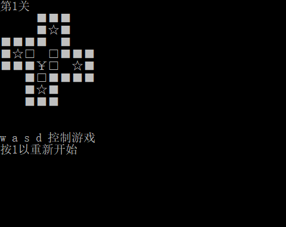
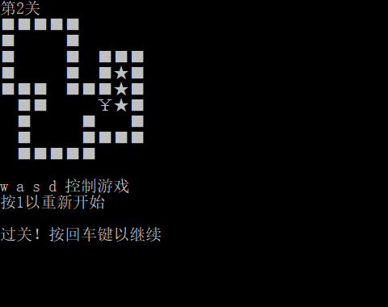
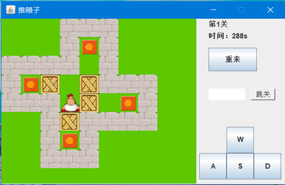
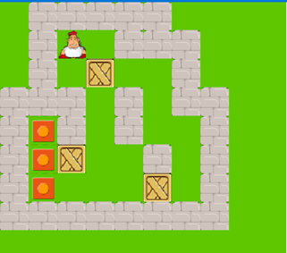
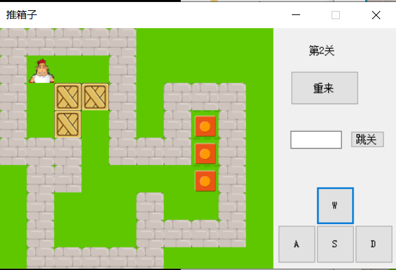
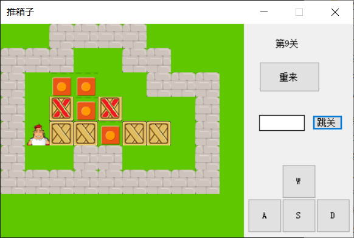

# C 语言版

文档看这里：[需求分析及设计文档](https://github.com/aBadString/Boxman/blob/master/C/doc.md)

 

 

# Java 版

文档看这里：[需求分析及设计文档](https://github.com/aBadString/Boxman/blob/master/Java/doc.md)

 

 

# C# 版

文档看这里：[需求分析及设计文档](https://github.com/aBadString/Boxman/blob/master/CSharp/doc.md)

 

 